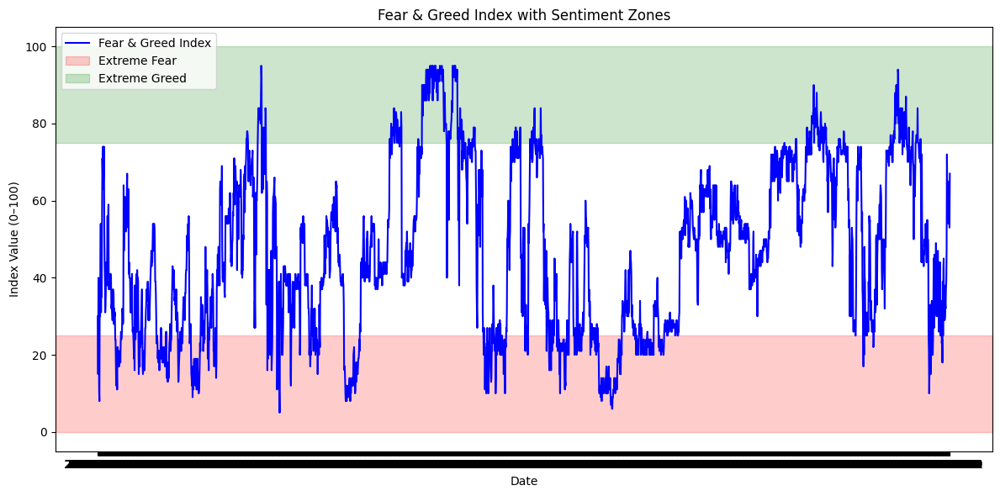

# 📊 Fear & Greed Index Analysis

## 📌 Project Overview
This project analyzes and visualizes the **Fear & Greed Index** from historical market sentiment data.  
It includes:
- Data preprocessing in Python
- Exploratory Data Analysis (EDA)
- Visualization of sentiment zones (Extreme Fear, Extreme Greed)
- Summarized insights in a PDF report

---

## 📂 Repository Structure
```
ds_AjayNishad/
├── notebook_1.ipynb           # Main Google Colab notebook (link provided below)
├── notebook_2.ipynb           # Optional additional notebook (if required)
├── csv_files/
│   └── fear_greed_index.csv   # Input dataset
├── outputs/
│   └── fear_greed_plot.png    # Visualization output
├── ds_report.pdf              # Summary of findings
└── README.md                  # Setup & instructions
```

---

## Google Colab Links
- **Notebook 1:** [View in Colab](https://colab.research.google.com/drive/1pEyRR8Sy43W50njQ76p7BoY-fG3rWtba?usp=sharing)  

---

## Setup Instructions
1. Clone this repository:
```bash
git clone https://github.com/ajxy1910/ds_AjayNishad.git
cd ds_AjayNishad
```

2. Install dependencies:
```bash
pip install pandas numpy matplotlib
```

3. Place `fear_greed_index.csv` inside the `csv_files/` directory.

4. Run the notebook in **Google Colab** or Jupyter Notebook.

---

## Example Output


---

## License
MIT License — free to use with attribution.
